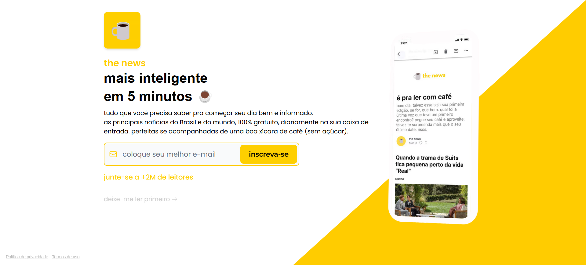

# The News - Clone

Este é um projeto de cópia da página de inscrição da newsletter "The News", um site que oferece as principais notícias do Brasil e do mundo de forma simples e rápida. O objetivo deste projeto é praticar e aplicar conceitos de HTML e CSS, com foco em um design responsivo e usabilidade para todos os dispositivos.

## 🚀 Tecnologias Utilizadas

- **HTML5**: Estruturação semântica do conteúdo.
- **CSS3**: Estilos, incluindo design responsivo utilizando a abordagem mobile-first.

## 🖼️ Demonstração



## 🚀 Link para o Deploy

Você pode ver a versão final do projeto em [aqui](https://the-news-clone.vercel.app/).

## 🔧 Como Executar o Projeto

1. **Clone o repositório:**

   ```bash
   git clone https://github.com/KevinTereza/the-news-clone.git
   ```

2. **Acesse o diretório do projeto:**

    ```bash
    cd the-news-clone
    ```

3. **Abra o arquivo index.html no seu navegador para visualizar o projeto.**

## 📄 Licença

Este é um projeto de estudo, uma cópia da página de inscrição da newsletter "The News". Não é um projeto comercial.
